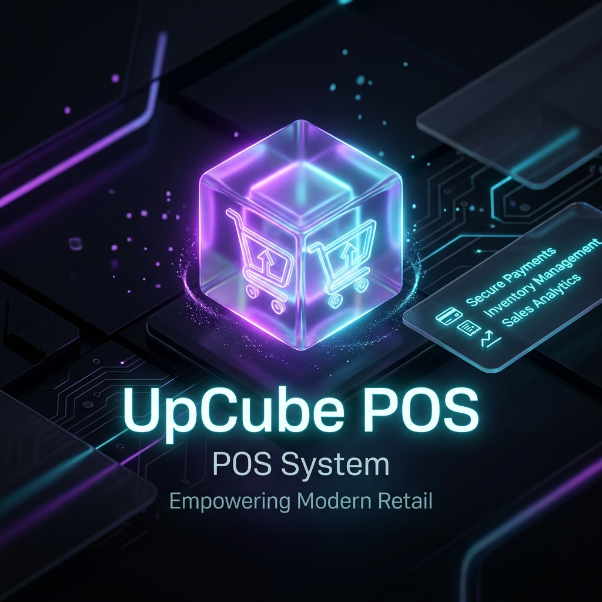

<div align="center">

# 🛒 UpCube POS System

[](https://laravel.com)
[](https://php.net)
[](https://getbootstrap.com)
[](https://opensource.org/licenses/MIT)

A premium, modern **Point of Sale (POS)** and **Inventory Management System** built with **Laravel**. UpCube offers a complete, robust, and clean dashboard layout to manage products, categories, suppliers, customers, purchases, and real-time inventory tracking in one centralized workspace.

---



</div>

---

## ⚡ Core Features

UpCube is engineered to simplify inventory operations and maximize retail productivity. Here's a breakdown of the key modules:

<table>
  <tr>
    <td width="50%">
      <h3>📦 Product & Inventory Management</h3>
      <ul>
        <li>Track real-time stock levels with automated alerts.</li>
        <li>Organize products by categories and customized units (kg, pcs, liters, etc.).</li>
        <li>Support for barcode ready/SKU items.</li>
      </ul>
    </td>
    <td width="50%">
      <h3>🤝 Customer & Supplier CRM</h3>
      <ul>
        <li>Keep records of supplier details, emails, and phone numbers.</li>
        <li>Build database of customers to track purchases and sales histories.</li>
        <li>Integrated relationships between suppliers and product supplies.</li>
      </ul>
    </td>
  </tr>
  <tr>
    <td width="50%">
      <h3>🛒 Purchase & Stock Restocking</h3>
      <ul>
        <li>Log purchase transactions for restocking products.</li>
        <li>Dynamic fields loaded via AJAX based on categories and products.</li>
        <li>Track purchase orders from pending to approved status.</li>
      </ul>
    </td>
    <td width="50%">
      <h3>📊 Intuitive Analytics Dashboard</h3>
      <ul>
        <li>Clean charts and metrics representing sales, stock value, and key activities.</li>
        <li>Authentication system out-of-the-box (Laravel Breeze).</li>
        <li>Profile updating and security configuration (Password changing).</li>
      </ul>
    </td>
  </tr>
</table>

---

## 🛠️ Architecture & Tech Stack

The architecture of UpCube POS ensures scalability, security, and responsive performance.

*   **Framework:** Laravel (v11.x) utilizing MVC pattern, Eloquent ORM, and Blade template engine.
*   **Database:** MySQL with relational integrity, cascading deletions, and indexed queries.
*   **Frontend UI:** Bootstrap 5, customized styles, and responsive layout.
*   **Dynamic Helpers:** jQuery & AJAX for quick, reload-free category and product loading.

---

## 📂 Project Structure

Below is an overview of the primary directories within UpCube:

```text
upcube/
├── app/
│   ├── Http/Controllers/Admin/
│   │   ├── AdminController.php         # Profile & Auth operations
│   │   └── Pos/
│   │       ├── CategoryController.php   # Category CRUD
│   │       ├── CustomerController.php   # Customer CRUD
│   │       ├── ProductController.php    # Product CRUD & logic
│   │       ├── PurchaseController.php   # Inventory restocking transactions
│   │       ├── SupplierController.php   # Supplier CRM
│   │       └── UnitController.php       # Measurement Units
│   └── Models/                          # Eloquent database models
├── config/                              # Laravel configuration files
├── database/
│   └── migrations/                      # DB schemas & relational tables
├── public/                              # Shared assets (CSS, JS, Images)
├── resources/
│   └── views/
│       ├── admin/                       # Admin panel templates
│       ├── layouts/                     # Master Blade layouts
│       └── auth/                        # Laravel Breeze login/register views
└── routes/
    └── web.php                          # Web route declarations
```

---

## ⚙️ Installation & Setup

Get your UpCube POS instance up and running locally.

### Prerequisites

Ensure you have the following installed:
*   PHP `^8.3` (with extensions: `pdo_mysql`, `bcmath`, `xml`, etc.)
*   Composer
*   MySQL/MariaDB Database Server
*   Node.js & NPM

### Step-by-Step Installation

1.  **Clone the Repository**
    ```bash
    git clone https://github.com/Zohaib-752/UpCube-POS.git
    cd UpCube-POS
    ```

2.  **Install Composer Dependencies**
    ```bash
    composer install
    ```

3.  **Install Frontend Assets**
    ```bash
    npm install
    npm run build
    ```

4.  **Configure Environment Variables**
    Copy `.env.example` to `.env` and configure your database settings:
    ```bash
    cp .env.example .env
    ```
    Open `.env` in your editor and configure your database connection parameters:
    ```ini
    DB_CONNECTION=mysql
    DB_HOST=127.0.0.1
    DB_PORT=3306
    DB_DATABASE=upcube_pos
    DB_USERNAME=root
    DB_PASSWORD=
    ```

5.  **Generate Application Encryption Key**
    ```bash
    php artisan key:generate
    ```

6.  **Run Database Migrations**
    Create the database configured above and run the migrations:
    ```bash
    php artisan migrate
    ```

7.  **Start the Local Server**
    ```bash
    php artisan serve
    ```
    Visit `http://127.0.0.1:8000` to access the application.

---

## 🚀 Usage Guide

1.  **Admin Login & Registration**: Log in with your registered account.
2.  **Manage Units**: Add unit types such as *Kg*, *Pcs*, *Liters*, etc.
3.  **Manage Suppliers**: Create supplier profiles to link them to your inventory items.
4.  **Manage Categories**: Set up product groupings (e.g., *Electronics*, *Groceries*, *Apparel*).
5.  **Add Products**: Go to *Manage Product*, select the supplier, category, unit, and name your product.
6.  **Restock/Purchase**: Create purchase orders when restocking products to automatically update inventory levels upon approval.

---

## 🔮 Roadmap & Upcoming Features

*   [ ] Barcode / QR Code Scanning for fast checkout.
*   [ ] Direct PDF/Thermal Receipt Printing integration.
*   [ ] Multiple stores/outlets sync support.
*   [ ] Advanced profit/loss reporting charts.
*   [ ] Multi-role user permissions (Admin, Manager, Cashier).

---

## 👨‍💻 Developer & Authors

Developed with ❤️ by **Zohaib**.

*   **GitHub:** [@Zohaib-752](https://github.com/Zohaib-752)
*   **Repository Link:** [UpCube POS GitHub](https://github.com/Zohaib-752/UpCube-POS)

---

⭐ **Show your support!** If you like this project, please consider giving it a star on GitHub.